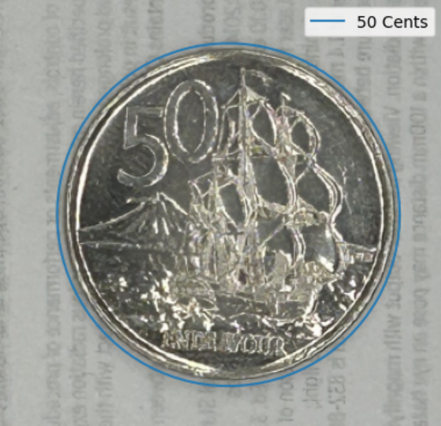
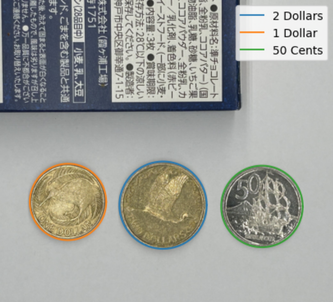
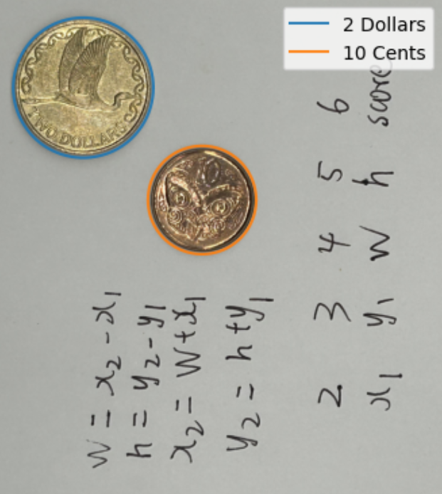

# coin_nn

One of the courses being taught at UoA (COMPSCI373) has an assignment that aims at detecting coins in an image. The fundamental part that every student has to submit uses proven methods in the Computer Vision ecosystem such as:
 - Greyscale conversion
 - Normalization
 - Histogram equalization
 - Schar filters
 - Mean filters
 - Adaptive thresholding
 - Morphological operations
 - Connected component analysis

Students are then encouraged to explore their own methods, and implement other methodologies that can be found online. I decided that coin identification would be a good option, so my pipline was expanded to:
 - `<the afore mentioned steps>`
 - A circle detection algorithm (much simpler and faster than the Circle Hough Transform, since there are already bounding boxes from the connected component analysis)
 - A neural network to predict what type of coin it is, with the already segmented image as input

This repository includes the code for my neural network, using `resnet18` as a base, and trained on the New Zealand dollar coins found in [this dataset](https://www.kaggle.com/datasets/wanderdust/coin-images/code).

Testing accuracy achieves just over `82%` which is ok, given the limited training data of `168 samples` across all classes.

Here are some of the results:

    
    
    

